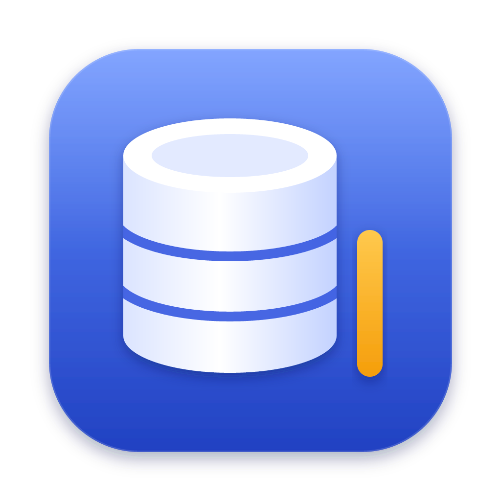

<p align="center">
  
</p>

<h1 align="center">IdeDB</h1>

<p align="center">
  <strong>A fast, native SQL IDE for macOS, built for the keyboard.</strong><br>
  PostgreSQL · MySQL · SQLite
</p>

<p align="center">
  <a href="https://github.com/naitsric/IdeDB/actions/workflows/ci.yml"></a>
</p>

<!-- screenshot: docs/screenshot.png -->

## Why IdeDB

IdeDB brings DataGrip-style workflows to a small, native Mac app. It is a
5 MB download, every action is a keystroke away, and it is careful
with real data: it checks your SQL against the server without running it,
never commits a transaction you opened, and asks before throwing away
unsaved work.

It can also share your connections with an AI assistant over MCP, on your
terms: you choose what each assistant may touch, approve every write, and
see every call it made.

## Features

### Connect
- **PostgreSQL, MySQL and SQLite**, with the same experience on all three.
- Paste a `postgres://` or `mysql://` URL and the connection form fills itself.
- **Passwords live in the macOS Keychain**, never in IdeDB's own files; or
  leave them unsaved and IdeDB asks once per session.
- TLS modes Disable, Prefer, Require and Verify full, with libpq semantics.
- Color-code data sources so production never looks like staging.

### Explore
- **Database Explorer** with schemas, tables, views and columns, primary and
  foreign keys marked, loaded on demand.
- **Speed search**: start typing in the tree to filter it.
- **Go to Table** (⌘O) finds any table in any connected database; schemas load
  in the background as soon as you connect.

### Write SQL
- A real code editor with dialect-aware highlighting, multiple cursors, search
  and IntelliJ-style editing keys.
- **Run the statement under the caret** with ⌘⏎, or a selection of several:
  each gets its own result tab, and the run stops at the first error.
- **Completion that knows your schema**: schemas, tables and columns, through
  aliases, ranked above keywords where a table belongs.
- **JOIN completion from foreign keys**: type `join` and get
  `customers c on c.id = o.customer_id`.
- **Live diagnostics**: the server checks your statements as you type without
  executing them, so errors, unknown tables and columns are underlined before
  you run anything.
- **Go to Declaration** (⌘B) jumps from a name in the editor to the table or
  column in the explorer. **Reformat** (⌥⌘L) tidies a statement or selection.
- A schema selector per console, and a searchable **query history** with the
  duration, row count or error of every run.

### Work with results
- A canvas-rendered grid, virtualized in both directions, that scrolls
  smoothly through large results.
- **Results load a page at a time** and fetch more as you scroll, so a huge
  table never floods memory.
- Value viewer for JSON and long text, and live count, sum, average, min and
  max of the selected cells.
- Copy as TSV, CSV, JSON or SQL INSERT; export results to CSV, JSON or SQL.
- Pin result tabs to keep them while you run other queries.

### Edit data
- Open any table (F4) and filter it with WHERE and ORDER BY fields.
- Edit cells, set NULL, add, duplicate and delete rows. Changes are marked until
  you **Submit (⌘⏎), in a single transaction**: if one change fails, none are
  applied and the failing row is highlighted.
- **Go to Referenced Row** (⌘B) follows a foreign key to the row it points to.

### Transactions you control
- **Auto or Manual** transaction mode per console, with Commit (⌥⌘⏎) and
  Rollback (⌥⇧⌘Z) and an indicator of how long a transaction has been open.
- IdeDB never commits or rolls back a transaction you opened, and it asks
  before closing a tab, disconnecting or quitting with one still open.
- If a lost connection or an implicit commit ends a transaction, the console
  tells you.

### Share with AI assistants
- A **built-in MCP server** for Claude Code, Claude Desktop, Cursor or any
  MCP client. It is reachable from this Mac only and stays off until you turn
  it on. See [Connect an LLM over MCP](#connect-an-llm-over-mcp).
- **A token per assistant**, revocable at once, and per connection access:
  none, read, or read and write.
- **You approve every write.** Reads run in read-only sessions; a statement
  that changes data or schema waits for you with the full SQL, the connection
  and the assistant's reason.
- **Every call is on record**: which assistant, which connection, the SQL,
  the rows, how long it took and what was decided. Filter the log and open any
  statement in a console.

### Feels like a Mac app
- Native menu bar, translucent sidebar, light and dark themes following the
  system, and a window that reopens where you left it.
- A 9 MB app on the system's WebKit and a Rust core.

## Keyboard

| Action                          | Shortcut |
| ------------------------------- | -------- |
| Search Everywhere               | ⇧⇧       |
| Find Action                     | ⇧⌘A      |
| Go to Table                     | ⌘O       |
| New Data Source                 | ⌘N       |
| New Query Console               | ⇧⌘L      |
| Execute statement / selection   | ⌘⏎       |
| Cancel running statement        | ⌘F2      |
| Query History                   | ⌥⌘E      |
| Reformat Code                   | ⌥⌘L      |
| Go to Declaration / Referenced Row | ⌘B    |
| Open Table Data                 | F4       |
| Submit data changes (in the grid) | ⌘⏎     |
| Commit / Rollback               | ⌥⌘⏎ / ⌥⇧⌘Z |
| Database Explorer               | ⌘1       |
| MCP (server, clients, activity) | ⌘8       |

Every action is also in Find Action (⇧⌘A) and in the menu bar.

## Install

Download the latest `.dmg` from
[Releases](https://github.com/naitsric/IdeDB/releases/latest) and drag IdeDB
to Applications. Requires macOS 13 or later on Apple Silicon.

Builds are not notarized yet, so macOS blocks the first launch. Run this once
after installing:

```sh
xattr -dr com.apple.quarantine /Applications/IdeDB.app
```

On Linux (x86_64), the same release has a `.deb` for Debian and Ubuntu, an
`.rpm` for Fedora and openSUSE, and an `.AppImage` for other distributions.
Linux builds don't save passwords yet: IdeDB forgets them when it quits.

## Connect an LLM over MCP

IdeDB can share your connections with an AI assistant (Claude Code, Claude
Desktop, Cursor or any [MCP](https://modelcontextprotocol.io) client). The
assistant never sees your passwords: it asks IdeDB, and IdeDB decides what
runs and keeps a record of every call.

1. **Turn the server on.** Open the MCP tool window (⌘8) and switch it on
   under **Server**. It listens on `127.0.0.1:7412`, reachable from this Mac
   only, and stays off until you turn it on.
2. **Create a client** for each assistant under **Clients**. IdeDB shows its
   token once, next to ready-to-paste setup for each assistant. Then pick
   which connections it may read, and which it may also write to. A
   connection's password must be saved in IdeDB to be shared.
3. **Connect the assistant**, with `<TOKEN>` replaced by the client's token.

**Claude Code**, in a terminal:

```sh
claude mcp add --transport http idedb http://127.0.0.1:7412/mcp --header "Authorization: Bearer <TOKEN>"
```

**Cursor**, in `~/.cursor/mcp.json`:

```json
{
  "mcpServers": {
    "idedb": {
      "url": "http://127.0.0.1:7412/mcp",
      "headers": { "Authorization": "Bearer <TOKEN>" }
    }
  }
}
```

**Claude Desktop** only launches local programs, so it runs IdeDB's own
bridge. In Claude, open Settings → Developer → Edit Config, add this to
`claude_desktop_config.json` and restart Claude. If IdeDB isn't open, the
bridge opens it in the background.

```json
{
  "mcpServers": {
    "idedb": {
      "command": "/Applications/IdeDB.app/Contents/MacOS/idedb",
      "args": ["mcp-bridge", "--port", "7412"],
      "env": { "IDEDB_MCP_TOKEN": "<TOKEN>" }
    }
  }
}
```

**You approve every write.** Reads run in read-only sessions. Anything that
changes data or schema waits for you in IdeDB, which shows the client that
asked, the connection, the full SQL with a warning for a `DELETE` without
`WHERE` or a `DROP`, and the assistant's reason. Reject has the focus and
Enter never approves. Mark a connection **Never write** to refuse writes
without asking. Revoking a client stops its token at once.

**See everything it did.** The **Activity** tab lists every call as it
happens: the client, the connection, the tool, the SQL, the rows returned or
changed, how long it took, and whether it ran, was refused, or was approved
or rejected by you. Filter it by client, connection, decision or SQL text,
and open any statement in a console to run it yourself. Results are never
stored, only what was asked and what happened.

**Share connections through a read-only database user.** A read-only session
stops writes, but not everything the database user itself is allowed to do
(in Postgres, for example, cancelling its own other sessions). A user that
can only read is the limit that holds.

## Roadmap

- SSH tunnels
- Transposed grid view
- Editable keymap
- Prompts for `:named` query parameters
- Notarized builds and automatic updates

## Contributing

IdeDB is built with Tauri 2, React and Rust. See
[CONTRIBUTING.md](CONTRIBUTING.md) to run it locally, run the tests and learn
how the code is organized.

## License

To be decided.

---

<sub>DataGrip is a trademark of JetBrains s.r.o. IdeDB is an independent project and is not affiliated with or endorsed by JetBrains.</sub>
